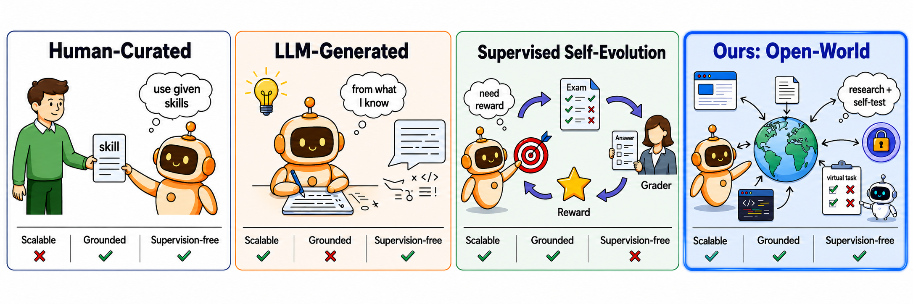
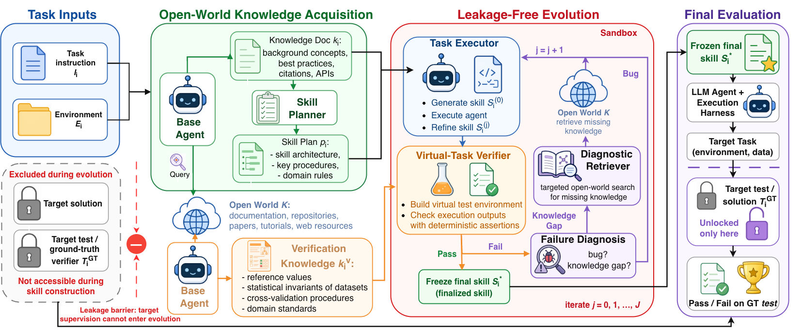
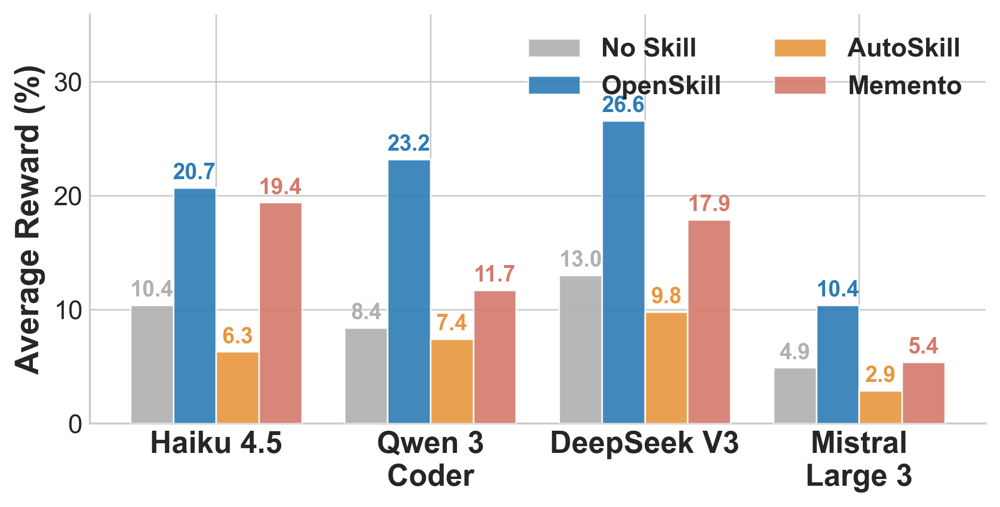
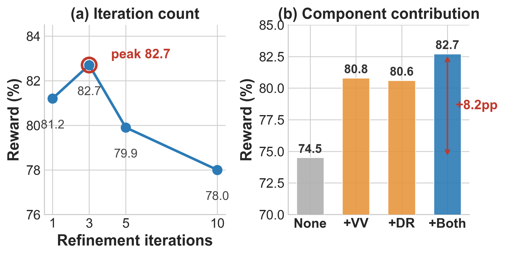
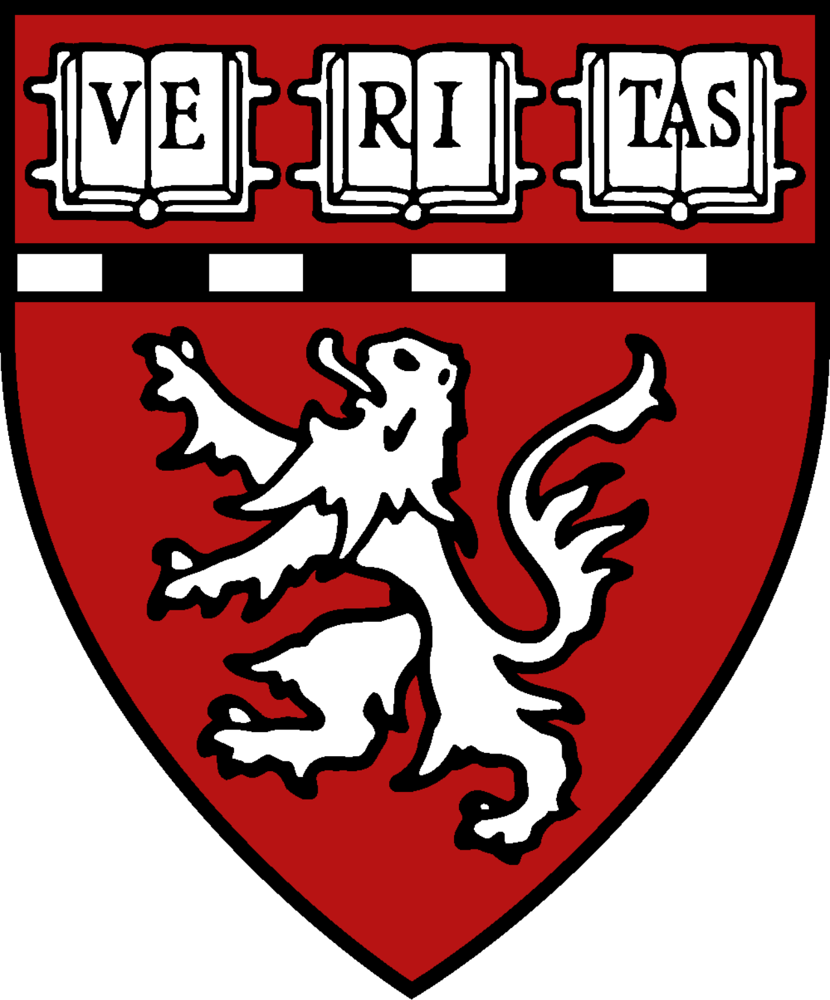

<div align="center">

# 🧭 OpenSkill

### Open-World Self-Evolution for LLM Agents

*An agent that builds both its skills and its own verification signals from scratch — using only a task prompt and open-world resources, with **no target-task supervision**.*

[](https://openlair.github.io/openskill/)
[](https://openlair.github.io/openskill/)
[](https://openlair.github.io/openskill/)
[](#-roadmap)
[](#-roadmap)

</div>

> [!NOTE]
> **Code is on the way.** This repository currently hosts the project overview and release plan.
> Star ⭐ and watch 👀 to be notified when the code, skills, and benchmark drop. See the [roadmap](#-roadmap).

---

## TL;DR

Self-evolving agents need to adapt *after* deployment — but existing methods assume a usable learning loop is already there: curated skills, successful trajectories, or verifier signals. Real open-world deployments may offer **none of these**, only a task prompt.

**OpenSkill** studies *open-world self-evolution*: an agent must build **both its skills and its own verification signals from scratch**, drawing on open-world resources but **no target-task supervision**. Target-task supervision is reserved strictly for final evaluation.

<div align="center">
<table>
<tr>
<td align="center" width="33%"><b>📈 Scalable</b><br/><sub>Skills are sourced from the open world, not bounded by a human's or model's prior knowledge.</sub></td>
<td align="center" width="33%"><b>🌐 Grounded</b><br/><sub>Knowledge and verification anchors come from real docs, repositories, and the web.</sub></td>
<td align="center" width="33%"><b>🔒 Supervision-free</b><br/><sub>No gold answers, rewards, or verifier outputs during learning — a leakage barrier keeps them out.</sub></td>
</tr>
</table>
</div>

---

## The Idea — a new paradigm for self-evolving skills

Unlike human-curated, LLM-generated, or supervised self-evolution, OpenSkill acquires skills from the open world and verifies them with self-built virtual tasks — making it **simultaneously scalable, grounded, and supervision-free**. Prior paradigms each miss at least one of these properties.

<div align="center">

</div>

---

## How OpenSkill works

Given only a **task prompt**, a **base model**, **tool access**, and **open-world resources**, OpenSkill bootstraps a learning loop from scratch in three stages.

| Stage | Name | What happens |
|:-----:|:-----|:-------------|
| **01** | **Open-world knowledge acquisition** | Retrieves task-relevant knowledge and independent verification anchors from docs, repos, papers, and the web — then drafts a structured skill plan. |
| **02** | **Leakage-free skill evolution** | Drafts skills and refines them in a sandbox against self-built virtual tests grounded in the anchors, fixing bugs and knowledge gaps over up to three rounds. |
| **03** | **Zero-shot target evaluation** | Deploys the *frozen* skill to the target agent. Ground-truth tests are unlocked only here, at final evaluation — never during construction. |

<div align="center">

<br/><sub>A leakage barrier keeps target supervision out of skill construction, unlocking it only for final evaluation.</sub>
</div>

---

## Results — best automated pass rate on every setting

On **SkillsBench** (11 domains) OpenSkill beats the strongest closed-world baseline by **+8.9 / +8.8** points and lands within **1–3 points of the human upper bound** — while honoring the no-supervision constraint.

<div align="center">

| Metric | Value |
|:------|:------|
| Overall pass rate on **Opus 4.6** | **43.6%** &nbsp;(+8.9 over best baseline) |
| Overall pass rate on **GPT 5.2** | **42.1%** &nbsp;(+8.8 over best baseline) |
| GT test intents covered by self-built verifier | **88.9%** |
| Domains best / tied-best on Opus 4.6 | **8 / 11** |

</div>

**SkillsBench — overall average pass rate (%)** &nbsp;*(Human = reference upper bound, excluded from ranking)*

| Target agent | No Skill | Self-Gen | CoT | Skill-Creator | AutoSkill | Memento | **OpenSkill** | Human |
|:-------------|:--------:|:--------:|:---:|:-------------:|:---------:|:-------:|:-------------:|:-----:|
| **Opus 4.6** (Claude Code) | 25.5 | 23.9 | 23.9 | 34.7 | 24.7 | 30.1 | **43.6** | *44.5* |
| **GPT 5.2** (Codex) | 25.0 | 32.2 | 33.3 | 29.2 | 11.2 | 15.6 | **42.1** | *44.8* |

> Beyond SkillsBench, OpenSkill is also the best automated method on **SocialMaze** (82.7% / 70.7%) and **ScienceWorld** (90.0% / 85.3%) across both target agents.

---

## Analysis — skills transfer, the verifier aligns, every component matters

<table>
<tr>
<td width="50%" valign="top">

**RQ1 — Transferability**
Skills generated by Opus 4.6 transfer **as-is** to four weaker models, improving by **+5.5 to +14.8** points over no-skill with no model-specific adaptation.

</td>
<td width="50%" valign="top">

**RQ2 — Virtual verifier quality**
Without ever seeing ground-truth tests, the verifier reaches **80.5%** recall against GT-positive outcomes, **60.7%** overall agreement, and covers **88.9%** of GT test intents.

</td>
</tr>
</table>

**RQ3 — Component contribution.** On SocialMaze, reward peaks at three refinement rounds; open-world query and the virtual verifier each improve over a parametric-only baseline and are largely complementary.

<div align="center">

&nbsp;

</div>

---

## 🗺️ Roadmap

Releases ship in phases. ⭐ the repo to get notified as each lands.

### 🟢 Now
- [x] Project page & overview — [openlair.github.io/openskill](https://openlair.github.io/openskill/)
- [ ] Paper preprint (arXiv) — *coming soon*
- [ ] BibTeX & citation metadata

### 🟡 Next
- [ ] Core **OpenSkill** framework code (knowledge acquisition → skill evolution → evaluation)
- [ ] Reproduction scripts for the SkillsBench main results
- [ ] Generated skill artifacts for the reported domains
- [ ] Open-source license

### 🔵 Later
- [ ] **SkillsBench** release (11 domains, tasks + harness)
- [ ] Virtual-task verifier toolkit
- [ ] Plug-in adapters for additional target agents (Claude Code, Codex, …)
- [ ] Tutorials & quickstart notebooks
- [ ] Leaderboard for open-world self-evolution

---

## Citation

```bibtex
@article{openskill2026,
  title   = {OpenSkill: Open-World Self-Evolution for LLM Agents},
  author  = {Yan, Zhiling and Song, Dingjie and Zhang, Hanrong and Liang, Wei and
             Zhang, Yuxuan and Dai, Yutong and He, Lifang and Yu, Philip S. and
             Xu, Ran and Li, Xiang and Sun, Lichao},
  journal = {arXiv preprint},
  year    = {2026}
}
```

---

## Authors

Zhiling Yan<sup>1,\*</sup>, Dingjie Song<sup>1,\*</sup>, Hanrong Zhang<sup>2</sup>, Wei Liang<sup>1</sup>, Yuxuan Zhang<sup>3,4</sup>, Yutong Dai<sup>5</sup>, Lifang He<sup>1</sup>, Philip S. Yu<sup>2</sup>, Ran Xu<sup>5</sup>, Xiang Li<sup>6</sup>, Lichao Sun<sup>1,†</sup>

<sup>1</sup> Lehigh University &nbsp;·&nbsp; <sup>2</sup> University of Illinois Chicago &nbsp;·&nbsp; <sup>3</sup> University of British Columbia &nbsp;·&nbsp; <sup>4</sup> Vector Institute &nbsp;·&nbsp; <sup>5</sup> Salesforce AI Research &nbsp;·&nbsp; <sup>6</sup> Massachusetts General Hospital & Harvard Medical School

<sub>\* Equal contribution &nbsp;&nbsp; † Corresponding author</sub>

<div align="center">
<br/>
 &nbsp;&nbsp;
 &nbsp;&nbsp;
 &nbsp;&nbsp;
 &nbsp;&nbsp;
 &nbsp;&nbsp;

</div>

---

<div align="center">
<sub><b>OpenSkill</b> · Open-World Self-Evolution for LLM Agents · 2026 · <a href="https://github.com/OpenLAIR">OpenLAIR</a></sub>
</div>
